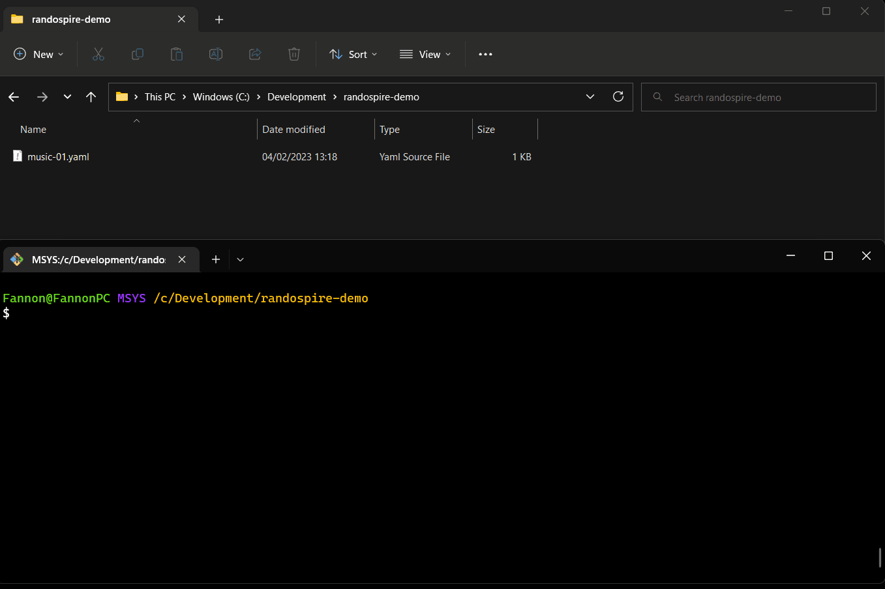

# randospire

A CLI tool that randomly picks files for you, so you can challenge yourself to create something with them.

For example, you can use it to pick random samples, MIDI files, presets of different categories for you. But in principle, it works with all kind of files.

> Sometimes external constraints and limitations are what inspire creativity most.
> Use randospire to make the decisions for you and see what you can make out of it.

To use it, you need to create a [config file](#config-file) which lists the folders and file extension to consider.

As a result, it will create a new folder and copy all the randomly chosen files into it according to the config structure.
It will also add a report, what files had been picked, where the originals are and where the copies are.

## Demo



## Use it without installation

* Prerequisite: Install [Node.js](https://nodejs.org/en/) (as a runtime)

```bash
# Execute it like following
npx randospire examples/music-example.yaml

# Optionally: Provide target directory:
npx randospire examples/music-example.yaml ./tmp
```

## Use it offline with installation

* Prerequisite: Install [Node.js](https://nodejs.org/en/) (as a runtime)

```bash
# Install or update the CLI globally
npm i -g randospire

# Now use it:
randospire examples/music-example.yaml ./tmp
```

## Config File

The config file is a multi-document [YAML](https://yaml.org/) file.
The interface is described in [src/config.ts](./src/config.ts), but how it works can be easily understood from [examples](./examples/).

It is probably easiest to copy one of the [examples](./examples/) and adjust it to your purposes.

Here is one example file with comments explaining it: [./examples/music-example.yaml](./examples/music-example.yaml):

```yaml
# Each --- indicates a new YAML document, or in our case, a new job
---
# The name should be something meaningful to you. 
# It also doubles as a folder name for the output, so make sure the names are unique and work as folder names 
name: Drum Hits
# How many files to pick randomly
amount: 7
# A list of input folders where to look for
inputFolders:
  - 'C:\Sound Library\AUDIO Drum Hits'
  - 'C:\Sound Library\AUDIO Drum Kits'
# Optional: Limit file extensions. If not given, all files are considered.
fileExtensions:
  - wav
  - flac

---
name: Drum Loops
amount: 2
inputFolders:
  - 'C:\Sound Library\AUDIO Drum Loops'

---
name: U-He Hive 2 Patches
amount: 5
inputFolders:
  # %USERPROFILE% can be used to point to the user home directory
  - '%USERPROFILE%\Documents\u-he\Hive.data\Presets\Hive'
```

## Tips & Tricks

> With [Bitwig](https://www.bitwig.com/de/), copy over everything into the project directory, then you can work with the Browser - Files on the right sidebar. With some presets (like u-he), you can even drag the presets into a track and it will load the instrument + the chosen preset directly!
